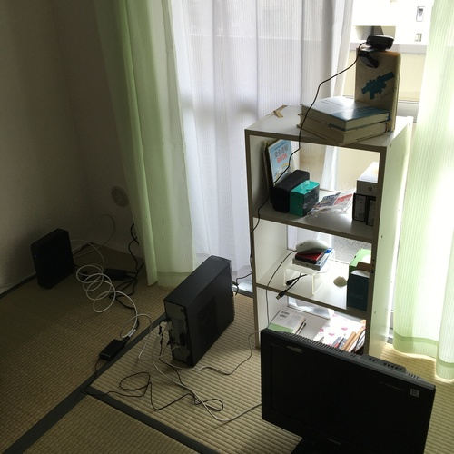

# kamsys
### a tiny (bash) shell script which I use to upload photos taken at my apartment. 

- [code](https://github.com/anissatta/kamsys/blob/main/kamsys.sh)

## How it works 

- It takes photo using a cellphone with *IPWebcam* installed. (It is a nice app which when started as a web server, takes a photo every time it receives a request at a certain port at which it listens and returns a JPEG image to the owner of the request) It then uploads the photo to a remote server via FTP after adding a timestamp to it.  It also creates a video file from photos it has taken using ffmpeg and uploads it, every time a number of unprocessed photos reaches 72.  
- fig 1: a computer running Kamsys at my apartment. 
  - 
